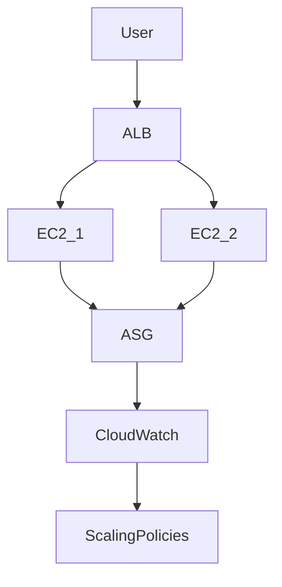
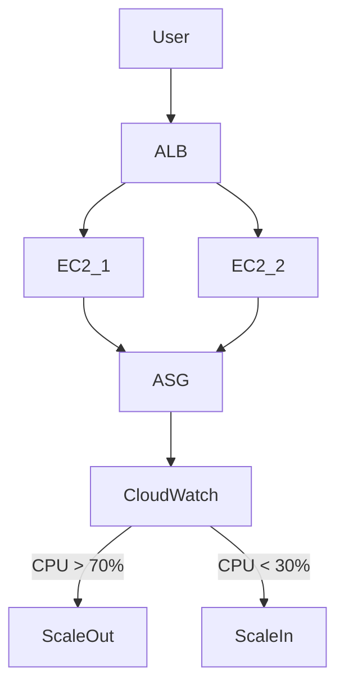
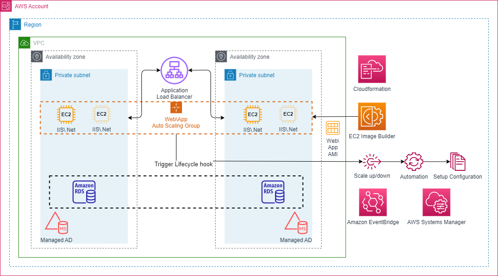

# 🚀 AWS Auto Scaling with ALB and CloudWatch

This project demonstrates how to build a **highly available and scalable AWS infrastructure** using:

- Amazon EC2
- Application Load Balancer (ALB)
- Auto Scaling Group (ASG)
- Amazon CloudWatch

---

# 🧊 Architecture



---

# 📁 Project Structure

```
aws-autoscaling-alb-project
│
├── scripts
│   └── install-web.sh
│
├── diagrams
│   └── architecture.png
│
└── README.md
```

---

# ⚙️ Services Used

- Amazon EC2
- Application Load Balancer
- Auto Scaling Group
- Amazon CloudWatch

---

# 🚀 Deployment Steps

### 1 Create Key Pair

```
aws ec2 create-key-pair --key-name MyKeyPair
```

### 2 Launch Base EC2 Instance

Install web server.

```
sudo yum install httpd -y
```

---

### 3 Create AMI

Create an image from EC2 instance.

---

### 4 Create Load Balancer

```
Application Load Balancer
Listener: HTTP 80
```

---

### 5 Create Launch Template

Configure:

- AMI
- Instance Type
- Key Pair
- Security Group

---

### 6 Create Auto Scaling Group

```
Min: 1
Max: 3
Desired: 2
```

Attach to ALB target group.

---

### 7 Configure Scaling Policies

Scale Out:

```
CPU > 70%
```

Scale In:

```
CPU < 30%
```
---

# 🔄 Architecture Flowchart


---


---

# 🧪 Testing Auto Scaling

Generate CPU load:

```
yes > /dev/null &
```

Stop load:

```
pkill yes
```

---
# 🔄 Screenshot 
 
 

---

 

---

 

----

 

---

# 🔄 DevOps Infrastructure

 

---

 

 ---

# 🎯 Key Benefits

✔ High Availability  
✔ Fault Tolerance  
✔ Automatic Scaling  
✔ Load Distribution  
✔ Cost Optimization  

---

# 👨‍💻 Author
<a href = "https://cinch-revamp-60906406.figma.site/"> Mr.Aniket A Firke</a>
<br>
DevOps Engineer  
AWS | Terraform | Docker | CI/CD
