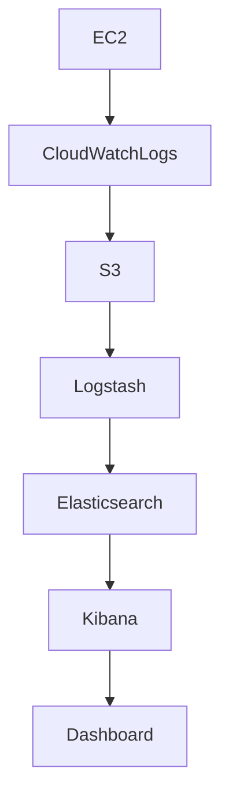
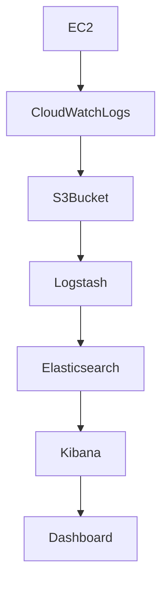
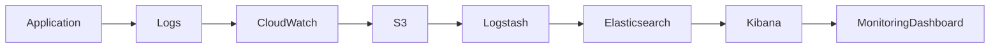
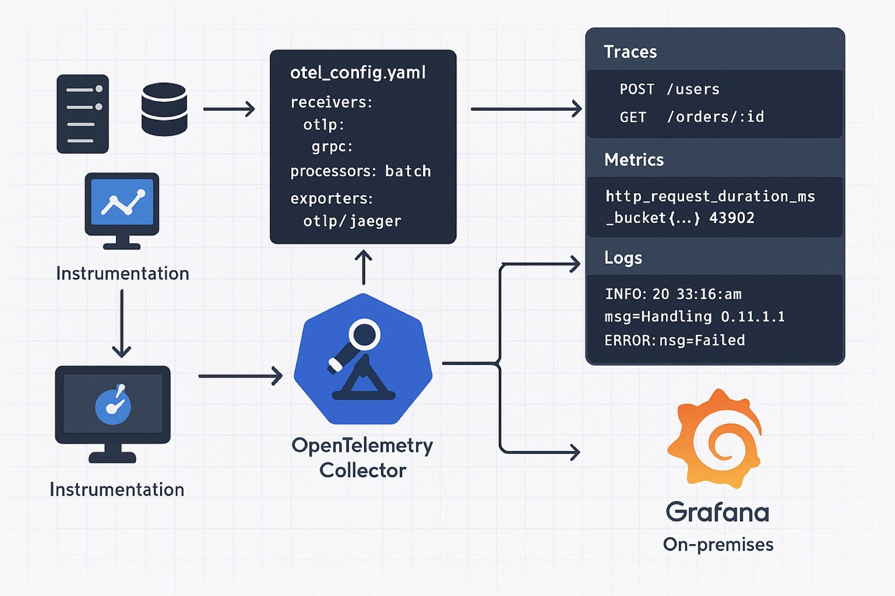
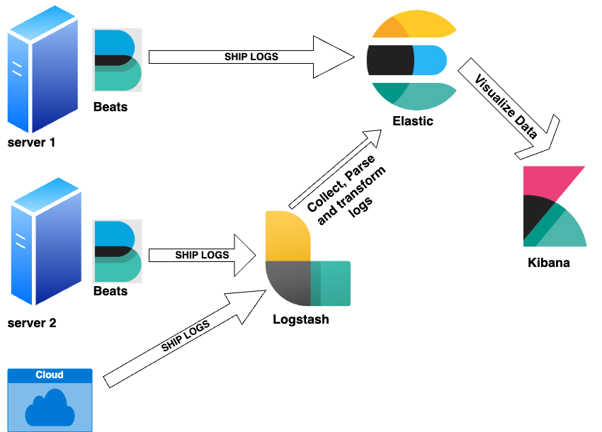
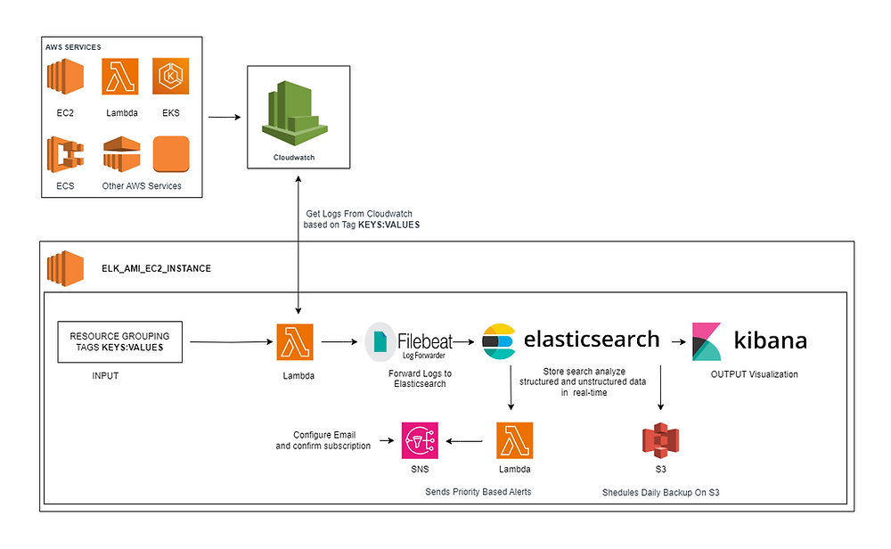
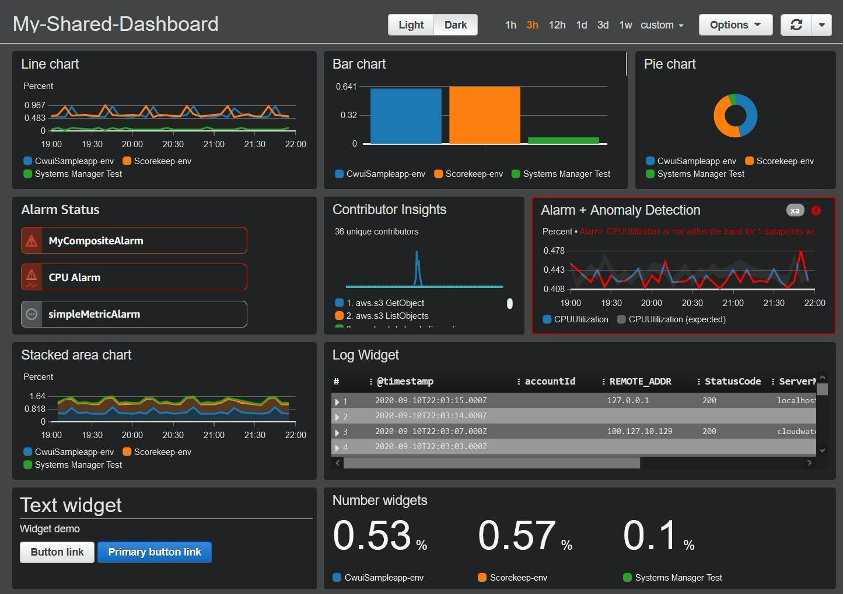

# 🚀 AWS Monitoring & Logging using ELK Stack and CloudWatch

This project demonstrates how to implement **centralized logging and monitoring** for AWS infrastructure using:

- Amazon CloudWatch
- ELK Stack (Elasticsearch, Logstash, Kibana)
- Amazon S3

---

# 🧊 Architecture



---

# 📁 Project Structure

```
aws-monitoring-elk
│
├── elk-config
│   ├── elasticsearch.yml
│   ├── logstash.conf
│   └── kibana.yml
│
├── scripts
│   ├── install-elk.sh
│   └── cloudwatch-agent.sh
│
└── README.md
```

---

# ⚙️ Services Used

- AWS CloudWatch
- Amazon S3
- Elasticsearch
- Logstash
- Kibana
- EC2

---

# 🚀 Deployment Steps

### 1 Install CloudWatch Agent

```
sudo yum install amazon-cloudwatch-agent
```

---

### 2 Deploy ELK Stack

Install:

- Elasticsearch
- Logstash
- Kibana

---

### 3 Configure Logstash

Example pipeline:

```
input → logs
output → elasticsearch
```

---

### 4 Visualize Logs

Access Kibana:

```
http://EC2-IP:5601
```

Create index:

```
logs-*
```

---
# 🔄 Monitoring Architecture Flowchart



---

# 🔄 Observability Pipeline



---

# 📸 Screenshots


---


---



---

# 📸 Observability-Infrastructure



---



---



---

# 🎯 Benefits

✔ Centralized Logging  
✔ Real-Time Monitoring  
✔ Fast Log Search  
✔ Infrastructure Observability  
✔ Alerting and Notifications  

---

# 👨‍💻 Author
<a href = "https://cinch-revamp-60906406.figma.site/"> Mr.Aniket A Firke</a>
<br>
DevOps Engineer  
AWS | Terraform | Docker | CI/CD | Monitoring
