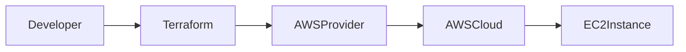
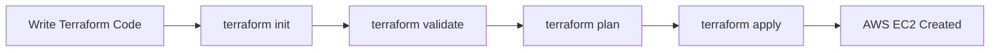

# 🚀 Terraform AWS EC2 Deployment

This project demonstrates how to deploy an **AWS EC2 instance using Terraform**.

Terraform is an Infrastructure as Code (IaC) tool that allows you to define and manage cloud infrastructure automatically.

---

# 📌 Project Architecture



---

# 📁 Project Structure

```
terraform-aws-ec2
│
├── provider.tf
├── main.tf
├── variables.tf
├── outputs.tf
├── terraform.tfvars
├── .gitignore
└── README.md
```

---

# ⚙️ Prerequisites

Before starting ensure you have:

- AWS Account
- IAM User with permissions
- Terraform Installed
- AWS CLI Installed

Check installation:

```
terraform -v
aws --version
```

Configure AWS:

```
aws configure
```

---

# 🛠️ Step 1: Clone Repository

```
git clone https://github.com/yourusername/terraform-aws-ec2.git

cd terraform-aws-ec2
```

---

# ⚙️ Step 2: Initialize Terraform

```
terraform init
```

---

# ✅ Step 3: Validate Configuration

```
terraform validate
```

---

# 📊 Step 4: Check Deployment Plan

```
terraform plan
```

---

# 🚀 Step 5: Deploy Infrastructure

```
terraform apply -auto-approve
```

This will create an **EC2 instance in AWS**.

---

# 🔎 Step 6: Verify Deployment

Open AWS Console:

```
EC2 Dashboard → Instances
```

You should see:

```
Terraform-EC2
```

---

# 🧹 Step 7: Destroy Infrastructure

To remove resources:

```
terraform destroy -auto-approve
```

---

# 📊 Terraform Workflow



---

# 🎯 Benefits of Terraform

✔ Infrastructure as Code  
✔ Automated Deployment  
✔ Reusable Configuration  
✔ Version Control Friendly  
✔ Multi Cloud Support

---

# 🧑‍💻 Author
<a href = "https://cinch-revamp-60906406.figma.site/"> Mr.Aniket A Firke</a>
<br>
DevOps & Cloud Enthusiast  
AWS | Terraform | Docker | CI/CD