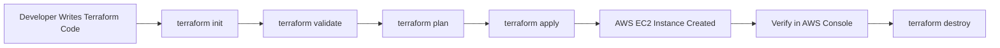
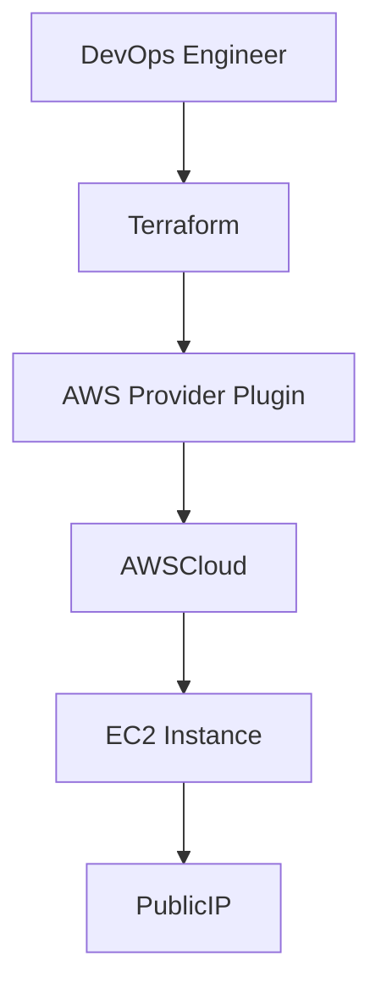

## Step 1: Initialize Terraform

```bash
terraform init
````

Terraform downloads the AWS provider plugins.

---

## Step 2: Validate Configuration

```bash
terraform validate
```

Output example:

```
Success! The configuration is valid.
```

---

## Step 3: Plan Deployment

```bash
terraform plan
```

Terraform will show what resources will be created.

Example:

```
+ aws_instance.web will be created
```

---

## Step 4: Deploy Infrastructure

```bash
terraform apply -auto-approve
```

Terraform will create the EC2 instance automatically.

Example output:

```
Apply complete! Resources: 1 added
```

---

## Step 5: Verify Deployment

Go to:

**AWS Console → EC2 → Instances**

You should see:

**Terraform-EC2**

Running instance.

---

## Step 6: Destroy Infrastructure

To remove all resources:

```bash
terraform destroy -auto-approve
```

Output:

```
Destroy complete! Resources: 1 destroyed
```

---

## 🔄 Terraform Workflow Flowchart



---

## 🔄 Terraform Architecture Flow




